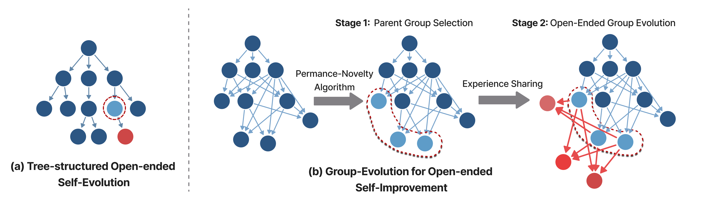
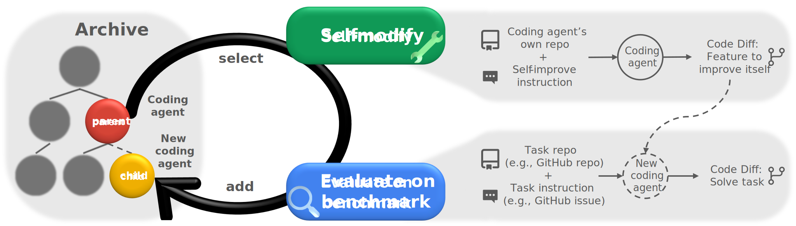

<h1 align="center">
    Group Evolving Agents:<br/>Open-Ended Self-Improvement via Experience Sharing
</h1>

<p align="center">
  <a href="[https://arxiv.org/abs/2505.22954](https://arxiv.org/pdf/2602.04837)"></a>
</p>


Repository for **Group Evolving Agents (GEA)**, a new paradigm for open-ended self-improvements, which treats a group of agents as the fundamental evolutionary unit, enabling explicit experience sharing and reuse within the group throughout evolution. 

<p align="center">
  
</p>
<!-- <p align="center">
</a><br>
</p> -->


## Setup
```bash
# API keys, add to ~/.bashrc
export OPENAI_API_KEY='...'
export ANTHROPIC_API_KEY='...'
```

```bash
# Verify that Docker is properly configured in your environment.
docker run hello-world
 
# If a permission error occurs, add the user to the Docker group
sudo usermod -aG docker $USER
newgrp docker
```

```bash
# Install dependencies
python3 -m venv venv
source venv/bin/activate
pip install -r requirements.txt

# Optional: for running analysis
sudo apt-get install graphviz graphviz-dev
pip install -r requirements_dev.txt
```

```bash
# Clone SWE-bench
cd swe_bench
git clone https://github.com/princeton-nlp/SWE-bench.git
cd SWE-bench
git checkout dc4c087c2b9e4cefebf2e3d201d27e36
pip install -e .
cd ../../

# Prepare Polyglot
# Make sure git is properly configured in your environment with username and email
python -m polyglot.prepare_polyglot_dataset
```

## Running the GEA
```bash
python GEA_outer.py
```
By default, outputs will be saved in the `output_dgm/` directory.

## File Structure
- `analysis/` scripts used for plotting and analysis
- `initial/` SWE-bench logs and performance of the initial agent
- `initial_polyglot/` Polyglot logs and performance of the initial agent
- `swe_bench/` code needed for SWE-bench evaluation
- `polyglot/` code needed for Polyglot evaluation
- `prompts/` prompts used for foundation models
- `tests/` tests for the DGM system
- `tools/` tools available to the foundation models
- `coding_agent.py` main implementation of the initial coding agent
- `GEA_outer.py` entry point for running the GEA algorithm


## Acknowledgement
This codebase is built upon the [Darwin Gödel Machine (DGM)](https://github.com/jennyzzt/dgm/tree/main).  We sincerely thank the authors for their inspiring and impactful work.

The evaluation framework implementations are based on the [SWE-bench](https://github.com/swe-bench/SWE-bench) and [polyglot-benchmark](https://github.com/Aider-AI/polyglot-benchmark) repositories.

## Citing
If you find this project useful, please consider citing:
```bibtex
@article{weng2026group,
  title={Group-Evolving Agents: Open-Ended Self-Improvement via Experience Sharing},
  author={Weng, Zhaotian and Antoniades, Antonis and Nathani, Deepak and Zhang, Zhen and Pu, Xiao and Wang, Xin Eric},
  journal={arXiv preprint arXiv:2602.04837},
  year={2026}
}
```
